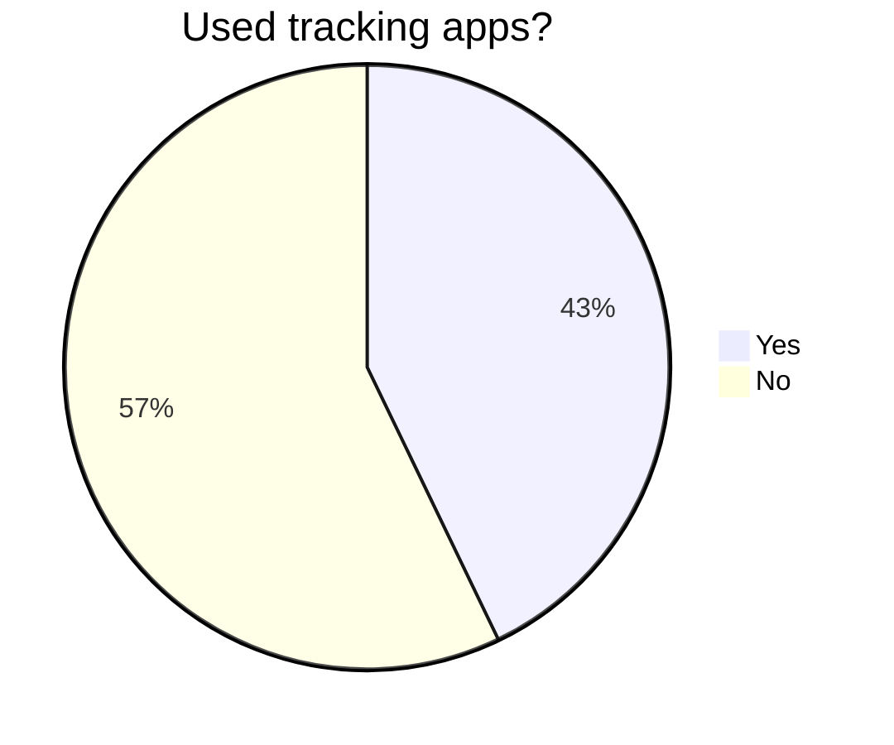

<!-- markdownlint-disable MD034 -->
<!-- markdownlint-disable MD046 -->

# Important notice

To ensure privacy & trust for our interviewees, their names and/or identifying characteristics must be anonymized. If someone wants their data removed, you can contact us @ our Github accounts and we will happily remove these.

## Table of contents

- [Important notice](#important-notice)
  - [Table of contents](#table-of-contents)
  - [Survey context \& description](#survey-context--description)
  - [Survey's questions overview](#surveys-questions-overview)
    - [1.0 Generic mood/mental state](#10-generic-moodmental-state)
    - [2.0 App-context](#20-app-context)
    - [Question formulation bias](#question-formulation-bias)
  - [Survey results](#survey-results)
    - [1.1 Can you describe a typical day for you, including your common activities, responsibilities and interactions?](#11-can-you-describe-a-typical-day-for-you-including-your-common-activities-responsibilities-and-interactions)
    - [1.2 How do you manage your mental health/mood on a day-to-day basis?](#12-how-do-you-manage-your-mental-healthmood-on-a-day-to-day-basis)
    - [1.3 What are factors that influence your mood throughout the day?](#13-what-are-factors-that-influence-your-mood-throughout-the-day)
    - [1.4 What are activities/habits that helped you overcome a bad day/barrier?](#14-what-are-activitieshabits-that-helped-you-overcome-a-bad-daybarrier)
    - [1.5 Can you recall a time you struggled with your mental health, what were some of the barriers you faced?](#15-can-you-recall-a-time-you-struggled-with-your-mental-health-what-were-some-of-the-barriers-you-faced)
    - [2.1 What challenges do you face when trying to track or better understand your own mood patterns?](#21-what-challenges-do-you-face-when-trying-to-track-or-better-understand-your-own-mood-patterns)
    - [2.2 Have you ever used tools to track your mental health/moods?](#22-have-you-ever-used-tools-to-track-your-mental-healthmoods)
    - [2.3 If so, what are some features you liked/disliked?](#23-if-so-what-are-some-features-you-likeddisliked)
    - [2.4 If an app existed to track your mood, what are some features you'd like to see within these applications?](#24-if-an-app-existed-to-track-your-mood-what-are-some-features-youd-like-to-see-within-these-applications)
    - [2.5 What specific data privacy features would you like to see in a mood tracking app?](#25-what-specific-data-privacy-features-would-you-like-to-see-in-a-mood-tracking-app)
    - [2.6 Do you have any comments/suggestions? (About anything you'd like)](#26-do-you-have-any-commentssuggestions-about-anything-youd-like)
  - [Footnote](#footnote)

## Survey context & description

_The survey's initial description:_

    Welcome to our survey,

    Your feedback is invaluable as we develop an innovative app to track daily moods and external factors affecting mental well-being. Your responses will help us tailor features to meet your needs while ensuring privacy and usability.

    Please take a few minutes to share your thoughts and experiences with us.

    IMPORTANT DATA NOTICE

    The answers to these questions will be used to develop/research an application which can help track moods. All data is anonymized and will not be shared with third parties, to ensure privacy we will remove any identifying characteristics from all answers. If at any time you wish to remove any data, please contact us.

    Thank you for participating!

## Survey's questions overview

### 1.0 Generic mood/mental state

    You may notice these questions are quite generic, that is done purposefully to not lead you towards a certain answer. Answer these as detailed/long as you feel comfortable with.

- 1.1 Can you describe a typical day for you, including your common activities, responsibilities and interactions
- 1.2 How do you manage your mental health/mood on a day-to-day basis?
- 1.3 What are factors that influence your mood throughout the day?
- 1.4 What are activities/habits that helped you overcome a bad day/barrier?
- 1.5 Can you recall a time you struggled with your mental health, what were some of the barriers you faced?

### 2.0 App-context

    We'll now dive more into the context of mobile application that can help you track/manage your moods.

- 2.1 What challenges do you face when trying to track or better understand your own mood patterns?
- 2.2 Have you ever used tools to track your mental health/moods?
- 2.3 If so, what are some features you liked/disliked?
- 2.4 If an app existed to track your mood, what are some features you'd like to see within these applications?
- 2.5 What specific data privacy features would you like to see in a mood tracking app?

        For example, do you want the ability to export your data, set permissions for who can access your information, or control how your data is shared with third parties? Please let us know which privacy features are important to you and how they can help you feel more secure about your data

- 2.7 Do you have any comments/suggestions? (About anything you'd like)

### Question formulation bias

To gain better into the formulation of the questions, here's a table representing the bias we are posing upon users due to phrasing.

| Question ID | Question formulation bias |
| ----------- | :-----------------------: |
| 1.1         |          Neutral          |
| 1.2         |          Neutral          |
| 1.3         |          Neutral          |
| 1.4         |         Positive          |
| 1.5         |         Negative          |
| ---         |            ---            |
| 2.1         |         Negative          |
| 2.2         |          Neutral          |
| 2.3         |     Positive/Negative     |
| 2.4         |          Neutral          |
| 2.5         |          Neutral          |
| 2.6         |          Neutral          |

## Survey results

**Why a survey instead of an interview-setting?**

The fear of asking these questions within an interview-type setting is the fact that the nature of these questions are quite personal and also a bit confrontational. They really ask a user to think about their mental/emotional well-being. The hope is that a fully anonymized survey will allow users more space to share their train of though next to the fact that a user has more time to think about an answer.

To ensure the privacy of the surveys participants, none of the actual answers will be added to this project's context. Only conclusions, generalized answers and anonymized data is shared. Underneath this paragraph, you will find 1 answer to each question, this is formulated based on all the respondent's answers. Within each question you will find, in **BOLD**, the most important information of that paragraph.

---

### 1.1 Can you describe a typical day for you, including your common activities, responsibilities and interactions?

Most (>80%) of the respondents noted having mixed schedules which can differ greatly between weekdays and weekends as well as during a workweek. A common pattern during weekdays was an early morning including breakfast, as most respondents seem to be students working part-time. What happens exactly during weekends is inconclusive, some work, some stay in bed for a large part of the day. A lot of respondents seem to have some type of part-time job which carries a variable workload, some use their off-time in the evenings, some use weekend. **What is clear is that a lot of these respondents have around 30-minute gaps in their schedules between appointments.**

### 1.2 How do you manage your mental health/mood on a day-to-day basis?

Half of the respondents noted that they do not actively manage/monitor their mental health. Those who have noted they do not actively monitor their mental health are the most busy, they fill their off-time with hobbies such as gaming, exercise or group sports. Other respondents have noted that keeping their regular rhythm helps greatly with managing their mental health, going about their days as they normally would. **Reflecting on how the day went with a bias towards the positive helped some respondents maintain a more positive outlook on their day.**

### 1.3 What are factors that influence your mood throughout the day?

**Most respondents noted that their ability to perform at school/work has a major influence on their energy level, which then leads to an effect in their mood.** Things such as their physical state (hormones, amount of sleep, ate etc.) also seem to bring both a positive and negative influence on their day-to-day moods. What people think of them seems to have a mostly negative impact, with compliments bringing somewhat joy to their day, yet social media, negative-feedback & bad work days seem to have a much stronger impact.

### 1.4 What are activities/habits that helped you overcome a bad day/barrier?

The answers here were very varied. Some respondents tended more towards non-digital solutions such as deep breathing exercises, journaling, talking to loved ones & self-reflection. However some respondents relied solely on digital means to get through their day. Things such as gaming, listening to music & watching videos. **Distractions would be a good way to group these variable results.**

### 1.5 Can you recall a time you struggled with your mental health, what were some of the barriers you faced?

More than 85% of the respondents have noted that they have struggled with their mental health before. With many problems variating from depressive episodes to body-dysphoria etc. Though this may seem inconclusive, it simply means that the users have a varied range of problems, issues and triggers for both positive and negative influences. **Which in turn translate to a very varied pallette of potential sources, meaning the problem is 'custom' to each user.**

---

### 2.1 What challenges do you face when trying to track or better understand your own mood patterns?

**Some respondents have noted that they struggle to find the right way to track their moods, tracking needs to be customizable, intuitive and take little effort in it's use.**

### 2.2 Have you ever used tools to track your mental health/moods?

### 2.3 If so, what are some features you liked/disliked?

Though not many respondents have used an application as such before, those who have had a lot of thoughts about their designs/usage.

| **Disliked features**                           | **Elaboration**                                                                        |
| ----------------------------------------------- | -------------------------------------------------------------------------------------- |
| Chatbot                                         | Feels insincere                                                                        |
| Shared stories from other users                 | Confrontational and bloats UI                                                          |
| Too much text in UI                             | Bloat UI, needs to be intuitive and quick to use                                       |
| Default reminders                               | Annoying/demotivating                                                                  |
| Forced account creation (non-local application) | Paywall / requires internet access, prefer local with extra option for online features |
| Confusing/'too much in' UI                      | Too many features leading to a confusing and overwhelming UI                           |

---

| **Liked features**                         | **Elaboration**                                                               |
| ------------------------------------------ | ----------------------------------------------------------------------------- |
| Customizable emoji's / names for moods     | Feels personal, like a sort of diary                                          |
| Checkboxes for daily activities            | Reminders of positive things throughout the day                               |
| Breathing/meditation exercises             | Helps to calm down, already inside app to track mood anyways                  |
| Easy stat tracking (no in-depth questions) | Quick and easy to do on-the-go                                                |
| Overview of tracked statistics             | Visualizing trends to get a better perception of oneself                      |
| Export tracked data                        | To allow migrations to other apps/phones and user to use data as they see fit |

### 2.4 If an app existed to track your mood, what are some features you'd like to see within these applications?

Respondents have noted that simplicity and how much time a user has to spent tracking is very important. They note that it's important

### 2.5 What specific data privacy features would you like to see in a mood tracking app?

To note some of the features which respondents would like:

- Password to enter application
- Permissions to share data (loved ones/healthcare providers)
- App be usable offline (local data only/mostly)
- Data be able to be used for analytics (anonymized)

### 2.6 Do you have any comments/suggestions? (About anything you'd like)

Though very little respondents actually answered this, as most of them were satisfied after the survey, here's 2 honorable mentions:

"Yeehaw" & "Please for the love of God, don't lock basic functionality behind a paywall."

## Footnote

We appreciate all the participants for taking some time out of their day to respond to our survey.
