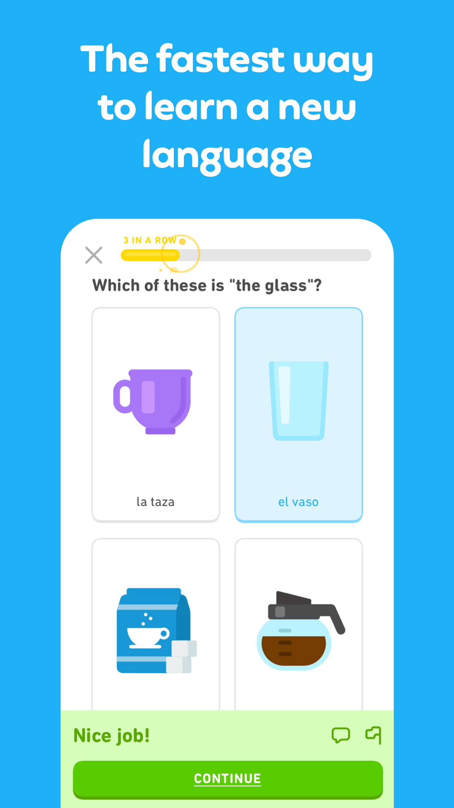
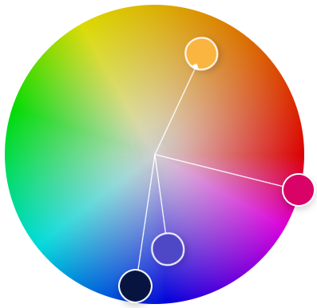
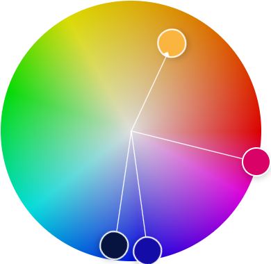
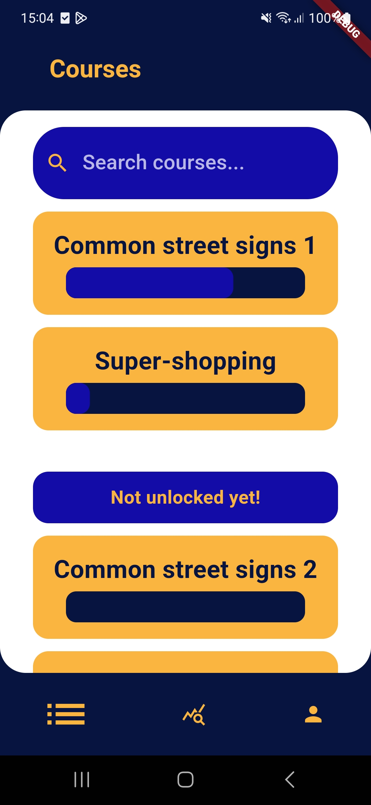
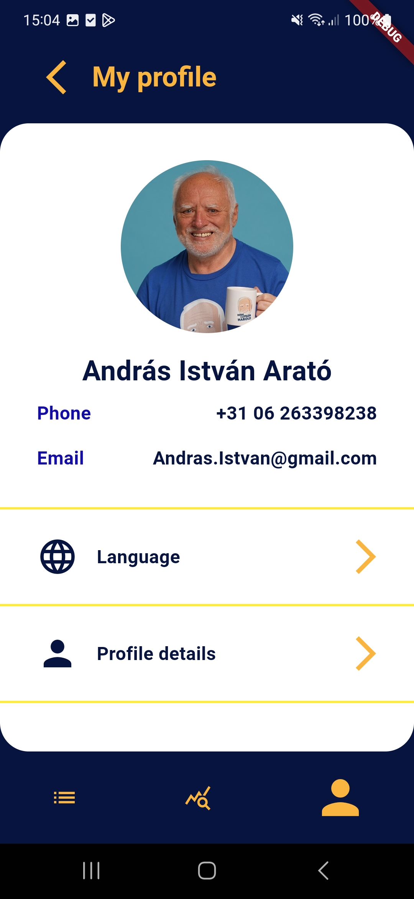
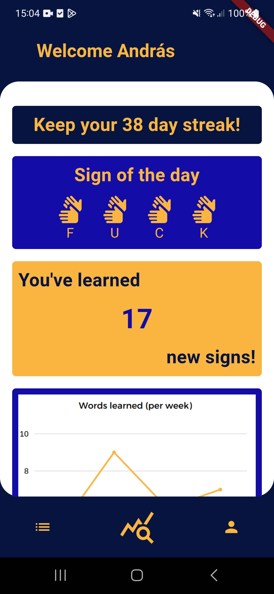

# Duo app 24: Cultural Exchange

## Overview

- [Duo app 24: Cultural Exchange](#duo-app-24-cultural-exchange)
  - [Overview](#overview)
  - [Canvas instruction](#canvas-instruction)
  - [Previous problem](#previous-problem)
  - [Analysis](#analysis)
    - [Problem definition](#problem-definition)
  - [Design](#design)
    - [Color palette](#color-palette)
    - [Version I](#version-i)
    - [Version II](#version-ii)
    - [Useful links](#useful-links)

## Canvas instruction

    Duo Case 24: Cultural Exchange

    Problem definition:

    In an increasingly globalized world, cultural exchange is more important than ever. However, platforms for authentic cultural exchange and learning can be hard to find. How can we create a mobile app that fosters genuine cultural exchange and understanding among users from different countries?

    Main research question:

    How can a mobile app effectively promote cultural exchange and understanding among users from different countries?

    Stakeholders:

    Individuals interested in learning about other cultures, educators, cultural organizations, potential investors.

    Possible sub-questions:

    • What are the key factors that promote authentic and respectful cultural exchange?
    • How can the app provide an engaging and educational platform for cultural exchange?
    • How can we ensure user privacy and security within the app's design?
    • How can we incentivize user engagement with the app over time?

    Do's:

    • Document and test at least three competitor apps/mobile solutions.
    • User experience must be intuitive, customizable, and easy to use.
    • Prioritize user privacy and security in the app's design.

## Previous problem

    The original main research question is formulated as follows:

    > How can a mobile app effectively promote cultural exchange and understanding among users from different countries?

    The problem with this question is that it is both not measurable, time-bound nor is it concrete enough. What does 'effectively' mean? What does 'understanding' in this context precisely encompass? With these constrains in mind a new question was formulated.

    > How can a mobile app facilitate in closing the barrier between cultures and languages using aiding features such as text-based translations, indicators languages/cultures?

    This is a lot better because it is more specific, yet we are missing a concise and clear target audience as well as a period of time to bind the question to.

    > How can we develop a mobile app in 3 weeks that can effectively utilize translations and cultural indicators to bridge cultural and language gaps among international travelers?

    Why is this question 'correct'? It's probably not, however this is generic enough to provide space for creativity, it is measurable, time-bound and specific to a single target audience. Hence we accept this question moving forward. Explanation for the selected specifics is as such:

    - International travelers
      - These users are more prone to be confronted with different cultures and are more than ever dependant on successful communication.
    - 3 weeks
      - This is the duration in which this specific project has to be completed, the learning curve of improving communication is a proces of iteration and thus cannot have a definite end.

However it was found rather difficult to get a start on this project, therefore it was decided to go back to the white-board and create a new idea, leading/sub-questions and problem definition.

## Analysis

### Problem definition

> In an increasingly globalized world, cultural exchange is more important than ever. However, platforms for authentic cultural exchange and learning can be hard to find. How can we create a mobile app that fosters genuine cultural exchange and understanding among users from different countries?

Within different cultures there are major differences in the method of communication and providing each other of shared knowledge. The app should solve the underlying issue of differences within expectations and communication between different cultures.

To aid the formation of a proper problem definition help was provided by a classmate, [Chantal Maas](https://www.linkedin.com/in/chantal-maas-605aa22a4/). One example of this is the mindmap which was created.

```Mermaid
mindmap
  )Cultural Differences(
    (People)
     Connection
     Habits
     Ethics
     Clothes
    (Understanding)
      Expectations
    (Language)
      Countries
      Signing
      Spoken
```

An idea to create an application was fostered by this. What is a way to learn more about cultures, communication & language in a fun & interactive way?

**An app to learn how to swear in sign-language.**

## Design

What are some (primarily mobile-) applications that reflect the same principles of improving cultural knowledge and the capacity to communicate.

- [Lingvano: Sign language - BSL](https://play.google.com/store/apps/details?id=com.lingvano.app)
- [Sign Language ASL Pocket Sign](https://play.google.com/store/apps/details?id=com.mobireactor.signlanguage)
- [Duolingo](https://play.google.com/store/apps/details?id=com.duolingo&hl=en&gl=US)

What are some common design choices between each application?

- Rounded square-ish boxes for content and interactions
- Simple UI with very little clutter
- Soft color pallettes
- Utilizing diagrams

<div align="center">
  
  
  
</div>

However the apps have a problem, their UIs are bland, not unique and very serious. The intend of our application is to create a low-effort, fun application.

### Color palette

To stand out more from other applications we have chosen a more bright color palette. These colours have not been spotted to be associated with other language/signing apps. Thus we would use this to stand out.

<table>
  <tr>
    <th>Title</th>
    <th>Color</th>
    <th>Hex Code</th>
  </tr>
  <tr>
    <td>Yellow</td>
    <td style="background-color:#FAB440; width:50px; height:50px;"></td>
    <td>#FAB440</td>
  </tr>
  <tr>
    <td>Blurple</td>
    <td style="background-color:#4E47C6; width:50px; height:50px;"></td>
    <td>#4E47C6</td>
  </tr>
  <tr>
    <td>Navy</td>
    <td style="background-color:#07143F; width:50px; height:50px;"></td>
    <td>#07143F</td>
  </tr>
  <tr>
    <td>Pink</td>
    <td style="background-color:#D90368; width:50px; height:50px;"></td>
    <td>#D90368</td>
  </tr>
</table>

These colours are a combination of both warm and cold tints in an attempt to create a balanced palette. The contrast is high enough that they are distinguishable from one another.



### Version I

[Version 1 - app design](../static/design-iteration-1.pdf)

We received some useful feedback from Marcel. He suggested the following things

- Less is more -> Creating more room creates more peace in the mind.
- Remember the context of the app -> A user is not stupid and KNOWS what app it's using.
- Consistency in margin/padding -> A more professional and consistent feel can lead to a more pleasant experience.
- Make it more clear what IS and ISN'T a button.

### Version II

- [Version 2 - app design](../static/design-iteration-2.pdf)

Using the feedback previously received a few choices were made.

- We implemented a header on every screen indicating what screen they were on.
- A new secondary color was chosen to improve contrast.

<table>
  <tr>
    <td>Blurple</td>
    <td style="background-color:#4E47C6; width:50px; height:50px;"></td>
    <td>#4E47C6</td>
  </tr>
</table>

Was turned into ->

<table>
  <tr>
    <td>Blue</td>
    <td style="background-color:#140CA7; width:50px; height:50px;"></td>
    <td>#140CA7</td>
  </tr>
</table>



- Padding/margins were standardized. Examples are that all page content (excluding header/footer) had a side-padding of 32. _(With exceptions for things such as dividers.)_

With these changes implemented we think the app has had a significant improvement to the user' experience.

[^1]

<div align="center">
  
  
  
</div>

### Useful links

- [ICT research methods](http://ictresearchmethods.nl/methods-per-project-phase/)
- [CMD Methods](https://cmdmethods.nl/?sort=strategy)
- [Color theory](https://www.canva.com/colors/color-wheel/)

[^1]: The weird 'gray-scale' effect visible on the header is an artifact of a missed property. This has been fixed in the current version of the app.
