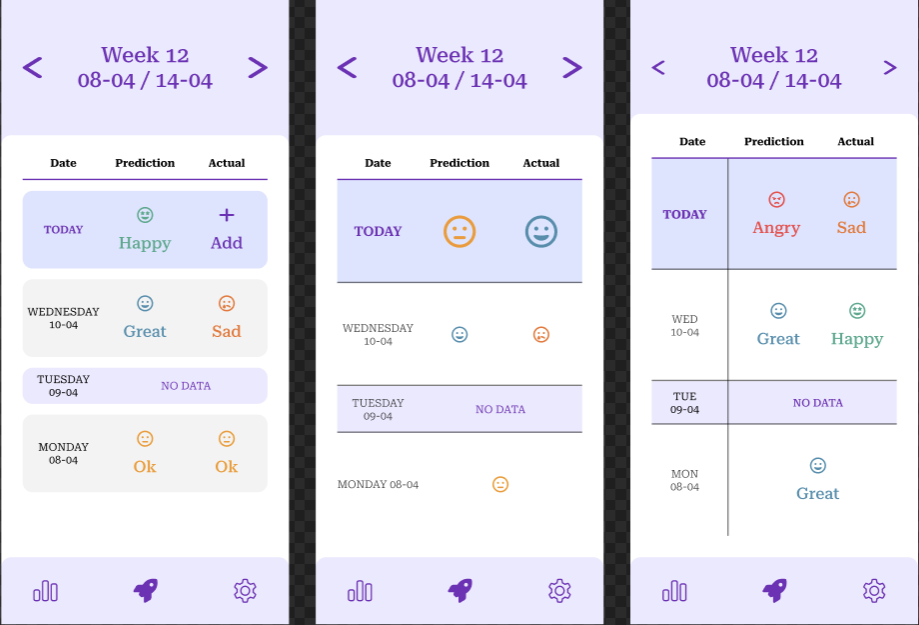
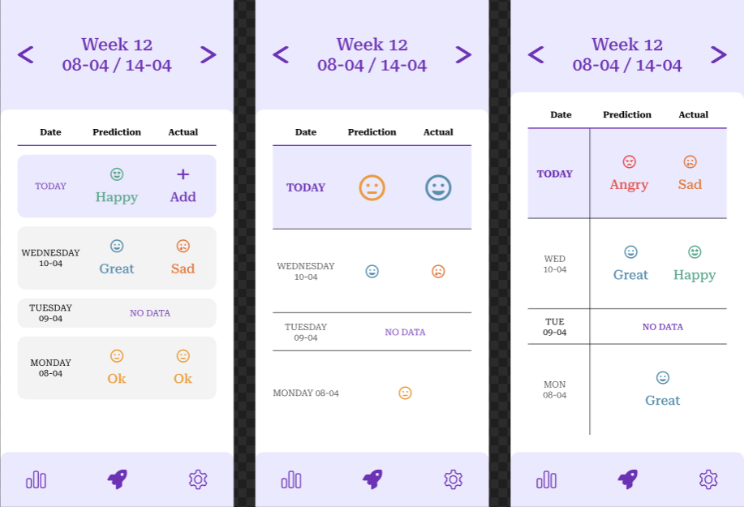
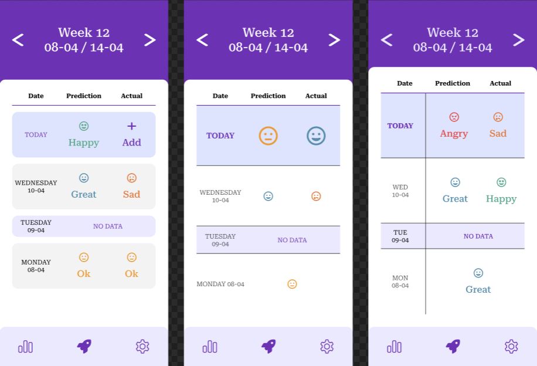
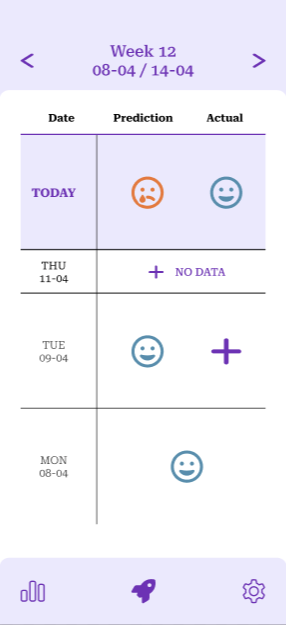

# Mood predictor - UX Testing

## Table of contents

- [Mood predictor - UX Testing](#mood-predictor---ux-testing)
  - [Table of contents](#table-of-contents)
  - [Introduction](#introduction)
  - [Designs](#designs)
  - [Results](#results)

## Introduction

This document serves as documentation for the UX research. We asked 3 individuals that match the target audience to answer some of our questions and/or for suggestions.

## Designs

The screens, from left to right the columns are A -> C. Going down they rows are numbered 1 -> 3.

## Results

In none of the instances did a tester refer to any of the 2nd rows in any of the designs. The reasoning for this was, as the testers noted, the fact that there is too little attention for the 'no data' row, as this is important to know when you're missing a day.

The testers seemed to know quite intuitively know what the 'home' page is supposed to be able to do. They noted it is to visualize the current on a day-to-day basis and allow the user to write down what the actual emotion of the day was.

They did note that a button/feature to 'tune' the algorithm when it is wrong would be a good addition. They also noted that an explanation WHY the algorithm thought you would be experiencing said predicted mood would be nice to have, yet he also noted he would NOT like that on the current (home) screen.

Upon this feedback we quickly iterated and made a cross-hybrid of the feedback, option D1.

 [^1]

The testers seemed to prefer this one the most, for the following reasons:

- The header is still easily accessible but not the biggest attention-grabber.
- The emoji's were sufficient to translate the different emotions.
- Because of no text under the emoji's, the 'no data' row was much more visible without extra emphasize required.
- The emoji size increase was a nice addition.
- They noted the table structure was much softer to the eyes and it was easy to see patterns.

[^1]: The extra padding above the header is because Figma's preview phone blocks that area.
