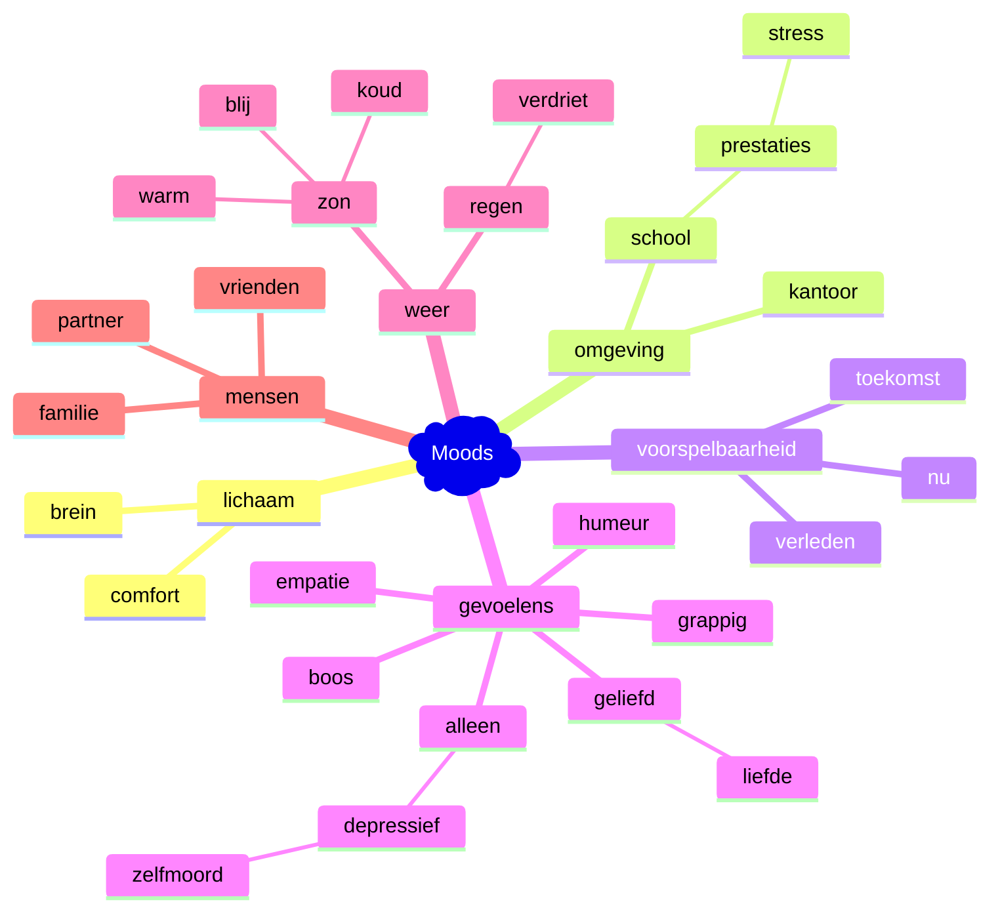
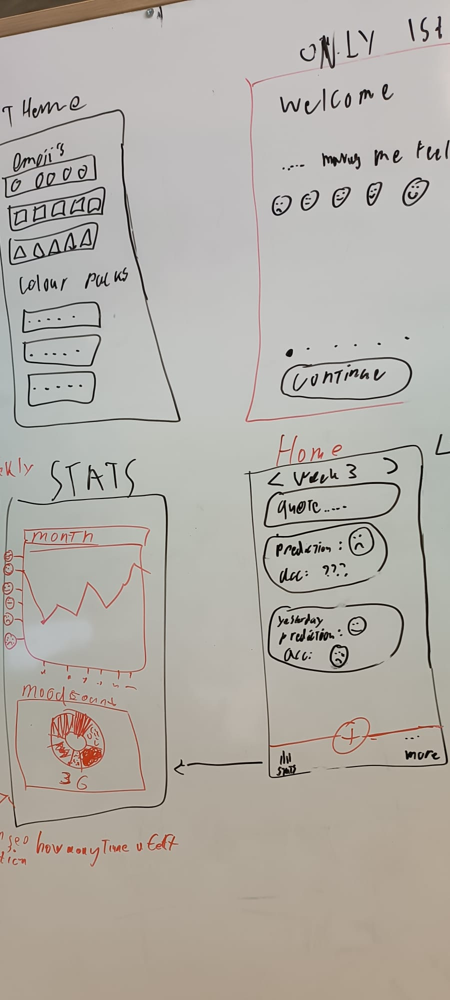
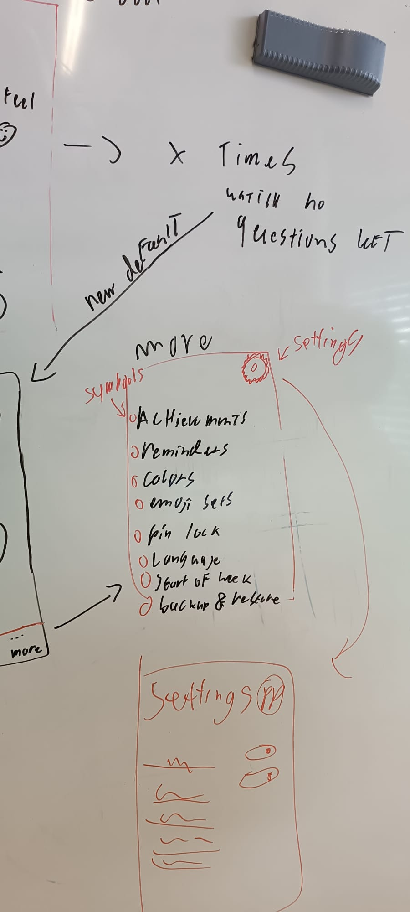
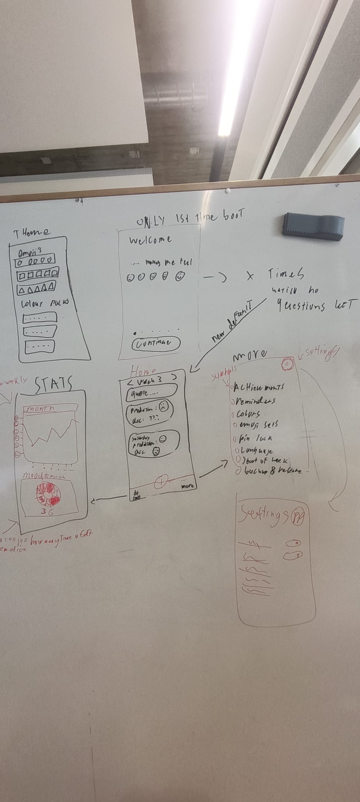
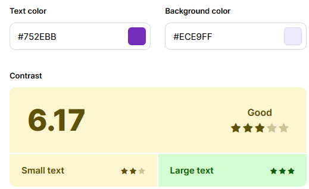
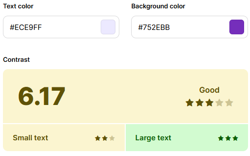

<!-- markdownlint-disable MD046 -->

# Mood predictor

## Overview

- [Mood predictor](#mood-predictor)
  - [Overview](#overview)
  - [Introduction](#introduction)
    - [Empathize](#empathize)
      - [Personas](#personas)
      - [Survey](#survey)
    - [Define](#define)
      - [1. What data visualization methods would be effective in helping users understand mood trends/patterns?](#1-what-data-visualization-methods-would-be-effective-in-helping-users-understand-mood-trendspatterns)
      - [2. How can we minimize the impact on user' daily routines yet still effectively predict moods?](#2-how-can-we-minimize-the-impact-on-user-daily-routines-yet-still-effectively-predict-moods)
        - [Passive data collection](#passive-data-collection)
        - [Scheduled prompts/notifications](#scheduled-promptsnotifications)
        - [Home-screen widgets](#home-screen-widgets)
        - [Calender synchronization](#calender-synchronization)
        - [Conclusion](#conclusion)
      - [3. What features are essential to help predict a user' mood?](#3-what-features-are-essential-to-help-predict-a-user-mood)
      - [4. How can we make the app customizable yet to a user's needs without overloading it with features?](#4-how-can-we-make-the-app-customizable-yet-to-a-users-needs-without-overloading-it-with-features)
    - [Ideate](#ideate)
      - [Brainstorming](#brainstorming)
      - [Competitor apps](#competitor-apps)
    - [Prototype](#prototype)
      - [Colour palette](#colour-palette)
      - [Iterations](#iterations)
        - [Version I](#version-i)
        - [Version II](#version-ii)
    - [Test](#test)
  - [External links](#external-links)

## Introduction

This document serves as the handlebars for our 2nd sprint, week 4 - 9, this is in regard to duo case 4: 'mood predictor'. Please note that some features may be duplicate as the 'design thinking' framework is not a linear process.[^1]

    Duo Case 4: Mood predictor

    An app that tracks the daily mood of the user. Simultaneously the app gathers data of external sources like the wheather, traffic for commuters, roster of the user, food intake of the user (fats, protein, carbohydrates), amount of physical activity (sports - also track the kind of sports: walking/running/biking) of the user, activities of the user by checking the users calendar, amount of sleep, amount of having sex, etc. Also data like how many persons the users speaks a day or how busy it is in the train driving to work or the fact that the favorite soccer club loses or wins play a role.

    The app gathers all this external data to see if there is a relationship between that data and the mood of the user. Ultimate goal is to predict the future mood of the user depending on the data and to give the user insight in external factors that determine his/hers mood.

    *Problem definition*
    People want to feel good all the time. But what situations trigger a person to feel good?

    *Opportunities*
    Interactivity, gaming, gamification, seamless experience, smart-watches, heartrate tracking, skin resistance measuring.

    *Research questions*
    What is a good way to track a user's mood without interrupting the user too much and without having the user invest too much time?
    What are good ways to visualize the trends in a user's mood?
    What are good stakeholders for an app like this?
    What external API's can we use?

    *Stakeholders*
    See above research question.

    *Approach*
    Write a debriefing with sub-questions, schedule appointments with stakeholders, interview domain experts*

    *Do’s*
    Add applicable research questions
    User experience must be playful.
    Think very carfully if you need external motivators like points (if any)

### Empathize

To keep the scope of the project precise, maintainable and specific the following target audience has been determined: 'Young adults from 16 to 25 who are actively working on/with their mental health.'

#### Personas

| **Attribute**  | **Boris Hendrix**                                                                                        | **Katie Acker**                                                                                         |
| -------------- | -------------------------------------------------------------------------------------------------------- | ------------------------------------------------------------------------------------------------------- |
| _Image_        |  |  |
| _Name_         | Boris Hendrix                                                                                            | Katie Acker                                                                                             |
| _Sex_          | Male                                                                                                     | Female                                                                                                  |
| _Age_          | 24                                                                                                       | 17                                                                                                      |
| _Occupation_   | Mental health coach                                                                                      | Full-time social work student                                                                           |
| _Background_   | Studied psychology                                                                                       | Part of the student's committee                                                                         |
| _Frustrations_ | - Balancing his own mental health parallel to his job.                                                   | - Feeling overwhelmed with all the work she has to do for both school and the committee.                |
|                | - Being uncertain and how his clients will make him feel.                                                | - Struggling to find time for self-care in her schedule.                                                |
|                | - Finds it difficult to keep track of his own mood.                                                      |                                                                                                         |
|                |                                                                                                          |                                                                                                         |
| _Motivations_  | - Wants to help others improve their mental health.                                                      | - Has a passion for fighting against inequality.                                                        |
|                | - Personal fulfillment by helping other individuals.                                                     | - Wants to engage her community and improve open dialogue sessions.                                     |
|                | - Continue to improve his personal mental health management.                                             | - Likes to embrace challenges as opportunities for growth.                                              |
|                |                                                                                                          |                                                                                                         |
| _Preferences_  | - Values his privacy and wants control over his data.                                                    | - Wants something flexible to fill the gaps in between her busy schedules.                              |
|                | - Wants to gain insights into patterns associated with his data.                                         | - Prefers being able to share data as to ease collaboration and teamwork.                               |

#### Survey

In order to get a better overview of what our users REALLY encounter in both problems, potential solutions and preferences we have held a survey. You can find the questions, overview, results & other information [here](../interviews-surveys/mood-mental-health-survey.md#surveys-questions-overview).

> However it was too inconclusive and generic to stimulate someone to think of a new idea. To manage this we've created a new, more direct survey with a clear path towards mood prediction over mood tracking.
>
> For this reason, we held another [survey](../interviews-surveys/mood-mental-health-survey-V2.md) to get a better view of which variables to track and associate with each mood, next to that we specifically asked user what they would like/dislike about a mood prediction app to get more direct answers.

### Define

Many young adults struggle to manage their mental health on a day-to-day basis, facing challenges such as variable schedules & difficulty in understand their own mood habits. While some young adults maintain their mental health using more digital means such as music or gaming, others seek comfort in measures such as journaling or breathing exercises. However the clear problem with all these tools is the lack of customization and a high-effort/low-reward pattern. As actively keeping track of your mood/habits takes (too-) much time. Users seem to be looking for a tool that's intuitive in it's usage, takes a relatively small portion of the day to use & has customization options.

1. What data visualization methods would be effective in helping users understand mood trends/patterns?
2. How can we minimize the impact on user' daily routines yet still effectively predict moods?
3. What features are essential to help user's track their mood?
4. How can we make the app customizable yet to a user's needs without overloading it with features?

#### 1. What data visualization methods would be effective in helping users understand mood trends/patterns?

When visualizing data it is important to choose the right method to display said data. Some of the options include[^2]

- Radial charts
- Bar charts
- Dot-matrix charts
- Heatmap
- Line graphs
- Radar charts

| Visualization Method | Description                                                                                                                                                                | Example                                                                                   |
| -------------------- | -------------------------------------------------------------------------------------------------------------------------------------------------------------------------- | ----------------------------------------------------------------------------------------- |
| _Radial Chart_       | A visualization where values and categories are arranged in a circular grid around a center point. Can be deceiving in comparing values due to the curvature of the chart. |  |
| _Bar Chart_          | Similar to a radial chart, but with vertical bars instead of a circular arrangement. Can become challenging with larger datasets when categorizing into time or trends.    |            |
| _Dot-Matrix Chart_   | Displays a series of data to show population and distribution within the data. Useful for tracking one mood over time intervals.                                           |     |
| _Heatmap_            | Visualizes trends using a table-like format. Useful for associating moods with colors and merging similar moods based on color-associated data.                            |         |
| _Line Graph_         | Common method for visualizing data over a custom period. Allows for tracking moods and in-between data points.                                                             |       |
| _Radar Chart_        | Allows for easy visualization of performance through quantitative comparisons. Can become confusing when layering polygons and distinguishing between diagrams.            |        |

Note for table above[^3]

| Method             | Good for long-term visualization (months/years) | Good for short-term visualization (days/weeks) |          Easy to read decimal values          |          Corelation to external data          |
| ------------------ | :---------------------------------------------: | :--------------------------------------------: | :-------------------------------------------: | :-------------------------------------------: |
| _Radial chart_     |    |   |  |  |
| _Bar chart_        |    |   |  |  |
| _Dot-matrix chart_ |    |   |  |  |
| _Heatmap_          |    |   |  |  |
| _Line graph_       |    |   |  |  |
| _Radar chart_      |    |   |  |  |

For the visualizations it might be most useful to use 'plain-old' line graphs. As these are most flexible, recognizable, specific enough (decimals) and work for both long- and short-term data visualization.

#### 2. How can we minimize the impact on user' daily routines yet still effectively predict moods?

There are a few options to gain data from a user to predict and track their moods without interrupting their daily routines, next to this the application will always have the ability to track/predict moods in-app.

- Passive data collection
- Schedules prompts
- Home-screen widgets
- Calender synchronization

##### Passive data collection

Passively collecting data through means such as smartphone sensors, location data or wearables to detect mood changes using physical methods such as heart rate monitoring, detecting movement patterns etc. without requiring further input from a user.

| Benefits                    | Drawbacks                                                                                                                         |
| --------------------------- | --------------------------------------------------------------------------------------------------------------------------------- |
| Requires minimal input      | Privacy concerns                                                                                                                  |
| Continuous data integration | Inaccuracy                                                                                                                        |
|                             | [Not something users want](../interviews-surveys/mood-mental-health-survey-V2.md#how-important-is-real-time-mood-tracking-to-you) |

##### Scheduled prompts/notifications

Allows users to sign up for schedules prompts/notifications at strategic times (breakfast, lunch, dinner, before bed etc.) throughout the day to input their current mood.

| Benefits                           | Drawbacks                         |
| ---------------------------------- | --------------------------------- |
| Record data at intervals           | Can be seen as annoying/intrusive |
| Customizable to a person' schedule | Requires active participation     |
|                                    | Inconsistent tracking             |
|                                    |                                   |

##### Home-screen widgets

Create customizable home-screen widgets that allow a user to on-the-go track their mood with a simple click.

| Benefits                   | Drawbacks                            |
| -------------------------- | ------------------------------------ |
| Quick and intuitive inputs | Limited specificity/details in moods |
| Reduced cognitive load     |                                      |
| Easy usage                 |                                      |
|                            |                                      |

##### Calender synchronization

Create time-slots within the free/designated spots of a user's calender allowing for scheduled and consistent tracking.

| Benefits                 | Drawbacks                                               |
| ------------------------ | ------------------------------------------------------- |
| Gain calender context    | Requires an up-to-date and specific calender            |
| Consistent and scheduled | Requires access to entire calender, privacy concerns    |
|                          | May not integrate properly and be perceived as annoying |
|                          |                                                         |

##### Conclusion

So what is the best option for perceiving data from a user? With regard to the [survey's results](../interviews-surveys/mood-mental-health-survey.md#surveys-questions-overview) it seems that data privacy is a major concern, leading to both 'passive' and 'calender' options not being viable.

#### 3. What features are essential to help predict a user' mood?

Essential features to implement to help predict our users mood in our application could be:

1. User input:

If a user is not yet known. So if he just downloaded the app we can't really predict a users mood. We can give some default recommendations on how most users feel them in common.

2. Behavioral analysis:

If a user downloads the app for the first time they can get welcomed by a series of short questions. And based on the response on these questions we can determine how the normally react on situations. So that a way how there mood can be predicted. This will get better overtime the more they use the app.

3. Feedback mechanism

Feedback is one off the best ways to impove.

#### 4. How can we make the app customizable yet to a user's needs without overloading it with features?

a few idea's we had to make an app customizable for a user but not overwhelming.

1. dark - light theme

its an easy thing to do but it can add so much to the experience of a user. Some people really prefer a dark mode in apps and it's a really easy thing to add so we really think this is a no brainer.

2. Preference categories

Preference categories is a way to really personalize an app without changing any features. In the app menu at the bottom or top of the screen a could make it so the icons are inner changeable so the can be at different places just like the home screens of phones. Where you can move around the apps to put them in there own space.

### Ideate

To ideate we have chosen to first start with a conventional brainstorming session to work out the most default answers, after which we are planning to use an ideation framework we have not used before.

To start we did a simple brainstorming session in the form of a mindmap to get our brains going.

#### Brainstorming

After which we created a basic storyboard to get a more general overview of functionality and looks of the application.

  
  
  

#### Competitor apps

|                        | MoodMe: Relationship Mood App                                                                                                                                                                                                                                                                                                              | Daylio Journal - Mood Tracker                                                                                                                                                                                                                                                                                                       | Mood Patterns                                                                                                                                                                                                                                                                                                                       |
| ---------------------- | ------------------------------------------------------------------------------------------------------------------------------------------------------------------------------------------------------------------------------------------------------------------------------------------------------------------------------------------ | ----------------------------------------------------------------------------------------------------------------------------------------------------------------------------------------------------------------------------------------------------------------------------------------------------------------------------------- | ----------------------------------------------------------------------------------------------------------------------------------------------------------------------------------------------------------------------------------------------------------------------------------------------------------------------------------- |
|                        | 
   
 | 
   | 
   |
| 
                 |
| Colors                 | Light themed with primarily blue accents                                                                                                                                                                                                                                                                                                   | Light themed with primarily green/blue accents                                                                                                                                                                                                                                                                                      | Gray-scale with various accents.                                                                                                                                                                                                                                                                                                    |
| Potential improvements | Very busy application, Poor contrasts                                                                                                                                                                                                                                                                                                      | More consistent coloring , customization locked behind paywall                                                                                                                                                                                                                                                                      | Less bland UI, more identity & consistency                                                                                                                                                                                                                                                                                          |
| Common/good features   | Very customizable                                                                                                                                                                                                                                                                                                                          | Consistent padding, intuitive & playful                                                                                                                                                                                                                                                                                             | Straight to the point UI, good at handling large volumes of data                                                                                                                                                                                                                                                                    |

### Prototype

Feel free to visit the [Figma file](https://www.figma.com/file/jL4eFw7Sp32cZ8vMQ4LUv2/MoodTracker?type=design&node-id=0%3A1&mode=design&t=1fAoXf3JNF4EDCEP-1) for all content related to the design/prototyping fase.

#### Colour palette

The palette was much simpler, to create a more professional looking environment as well as it giving us the chance to design something where colour is not the primary source of attention-grabbing. These colors are the right contrast for web-based applications.

| Title       | Color                                                           | Hex Code |
| ----------- | --------------------------------------------------------------- | -------- |
| Primary     |  | #752EBB  |
| Secondary   |  | #ECE9FF  |
| Background  |  | #FFFFFF  |
| Dirty-white |  | #F3F3F3  |

#### Iterations

To accompany these designs we speak of 2 major versions, our original fletched-out idea and the version which includes new screens for UX testing.

##### Version I

[Version 1 - app design](../static/MoodTracker-v1.pdf)

The original version of the app, as most screens are implemented within the mobile application.

##### Version II

[Version 2 - app design](../static/MoodTracker-v2.pdf)

The secondary version of the app, here we created some alternative designs to the home screen based on a few concerns:

- 'TODAY' is the most important, yet the actual importance within the screen is relatively low, how do we improve it's significance?
- What are 'good' ways to visualize missing data?
- How many days would a user WANT to see at once?
- If a prediction matches the actual state, why show 2 emojis?
- Is the current structure correct, what are alternative options?
- Is the text necessary? As emoji's/emoticons are essentially a 'universal' replacement for text. [^4]

### Test

We did some [UX testing](../research/mood-predictor-ux-testing.md) by asking multiple (target audience-) users their opinions of different screens, only giving out the base information such as what the app is, what it is supposed to do and what the screen's place is within the application. Here we asked individuals to rate each screen on what they thought the intention was, what aspects they liked/disliked etc. Eventually we came up with the final version (final screen in [V2](#version-ii)) of the designs, we implemented this but sadly were not able with the time left to UX test the actual implementation.

## External links

[^1]: [The Interaction Design foundation is a foundation which focuses on designing a pleasant user experience through course work and learning materials.](https://www.interaction-design.org/literature/topics/design-thinking)
[^2]: [The Data Visualisation Catalogue is a project developed by Severino Ribecca to create a (non-code-based) library of different information visualisation types.](https://datavizcatalogue.com/index.html)
[^3]: [Content was original written by a person but later reformatted and compacted by ChatGPT.](https://chat.openai.com/)
[^4]: [As implied here by the creator of the Emoticon (predecessor of emoji's)](https://web.archive.org/web/20071012051803/http://www.cnn.com/2007/TECH/09/18/emoticon.anniversary.ap/index.html)
